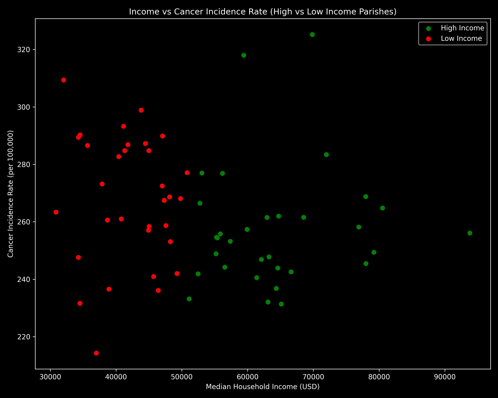
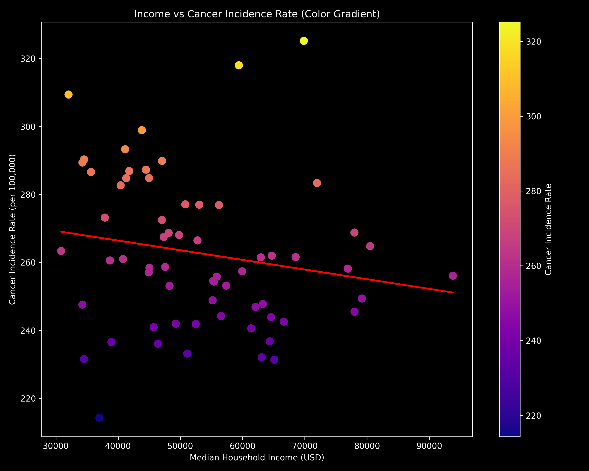
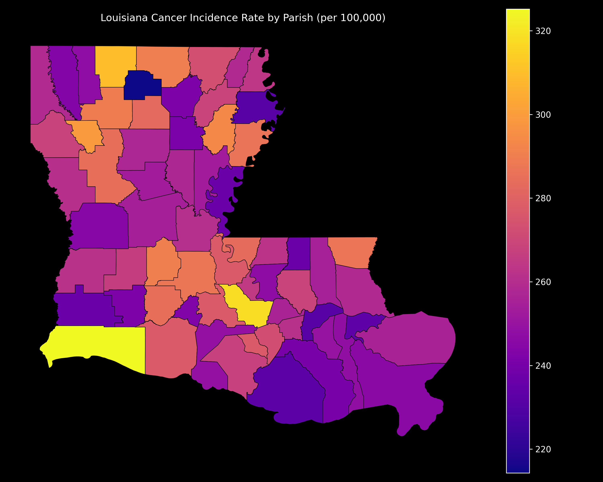
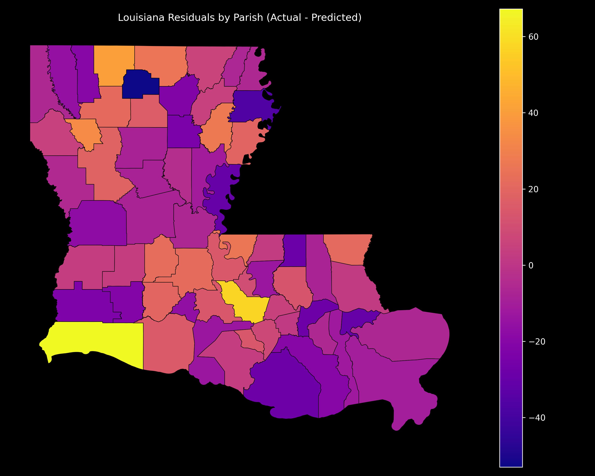

# Louisiana Parish Cancer & Income Analysis
### Overview
This project analyzes the relationship between median household income and cancer incidence rates across Louisiana parishes. Using regression modeling and geospatial visualization, the analysis evaluates whether income levels are associated with variation in cancer incidence and identifies parishes with higher than expected cancer rates.
### Research Question
Is there a meaningful relationship statistically between cancer incidence rates and median household income across Louisiana Parishes?
### Methods
- Data cleaning and parish name standardization 
- Dataset merging (cancer + income + shapefile)
- Correlation and linear regression modeling 
- Residual analysis (actual − predicted cancer rates)
- Choropleth mapping using GeoPandas
### Key Findings
- The relationship between cancer rates and median household income is a weak negative correlation (r ≈ -0.18).
- Income explains approximately 3% of variation in parish level cancer incidence rates.
- Cancer incidence demonstrates a geographic clustering across all parishes in Louisiana.
- The residuals analysis reveals that parishes with elevated cancer rates beyond what median income predicts.
- A $10,000 increase in median income is associated with ~X fewer cancer cases per 100,000 residents.
### Visualization
##### Scatter Plot with High and Low Income

##### Scatter Plot with Regression

##### Cancer Choropleth Map

##### Residuals Choropleth Map (Controlling Income)

### Project Structure
```
.
├── README.md
├── data
├── main.py
├── notebooks
│   └── analysis.ipynb
├── reports
│   └── figures
├── requirements.txt
└── src
```
- data/ - raw and processed datasets
- notebooks/analysis.ipynb - full exploratory and statistical analysis
- reports/figures/ - saved visualizations used in README
- requirements.txt - project dependencies
- src/ - data cleaning and merging scripts
### Installation
```
pip install -r requirements.txt
```
### Conclusion
- The study investigates where the median household income in Louisiana parishes is associated with cancer incidence rates. The results suggest that there is a weak negative correlation relationship (r ≈ -0.18), meaning higher house income tend to have lower cancer rates. However, income only explains a very small amount (\$R^2\$) of the overall variation in cancer incidence.
- The geospatial maps reveal noticeable regional clustering, and the residual analysis shows that some Louisiana parishes experience a higher than expected cancer rate even after accounting for median income. This suggests that there are additional factors such as environmental, structural, and demographic factors that likely contribute to cancer disparities across the state. Future studies will be incorporating multiple varaibles that would provide a more complete understanding of these patterns.
### Data Sources

- Louisiana Cancer Incidence Rates (2018-2022)
    - https://statecancerprofiles.cancer.gov/incidencerates/index.php?statefips=22&areatype=county&cancer=001&race=00&sex=0&age=001&ruralurban=0&type=incd#results
- S1901 | Income in the Past 12 Months (in 2022 Inflation-Adjusted Dollars)
    - https://data.census.gov/table/ACSST5Y2022.S1901?q=Median+household+income+Louisiana+parish+ACS+5-year&g=040XX00US22$0500000&y=2022&moe=false&tp=false&tableFilters=ag-Grid-AutoColumn~(Margin+of+Errorundefined)
- Louisiana Parish Shapefile
    - https://virtual.la.gov/datasets/louisiana-parishes/explore?location=30.936899%2C-91.400771%2C7